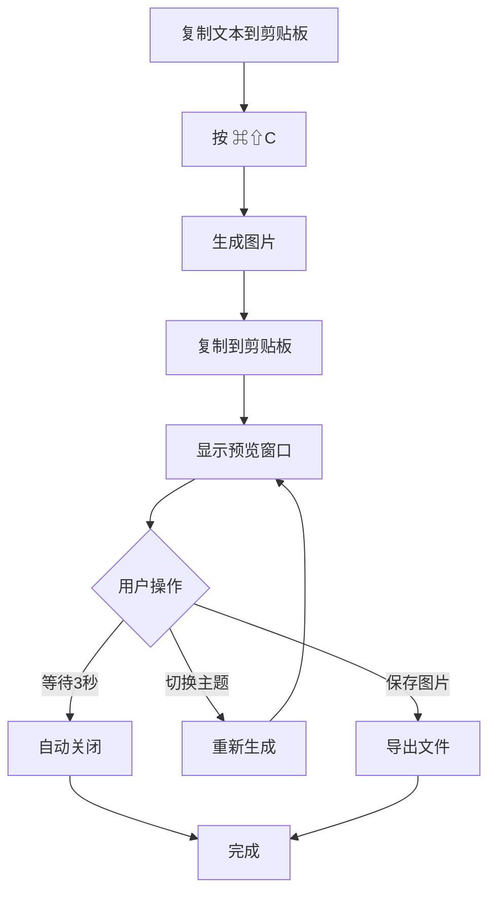

# 项目概览

## 📋 项目简介

TextToShare 是一个轻量级的 macOS 桌面应用，致力于解决一个简单而常见的需求：将文本快速转换为美观的图片，便于在社交媒体、即时通讯工具中分享。这个工具特别适合分享代码片段、名言警句、重要信息等内容。

## ✨ 核心功能

### 🚀 一键转换
- 复制任意文本到剪贴板
- 使用全局快捷键 `⌘⇧C` 快速生成图片
- 生成的图片自动复制回剪贴板

### 🎨 多主题支持
- **浅色主题**：简洁的白色背景，适合日间模式
- **深色主题**：深色背景配白色文字，适合夜间模式
- **渐变主题**：优雅的渐变背景，视觉效果出众

### 👀 实时预览
- 弹出预览窗口查看生成效果
- 支持实时切换主题
- 窗口 3 秒后自动关闭

### 💾 一键保存
- 点击保存按钮导出 PNG 图片
- 自动命名包含时间戳
- 支持选择保存位置

## 🛠️ 技术栈

### 核心技术
- **开发语言**: Swift 5.0+
- **UI 框架**: AppKit（macOS 原生开发）
- **图形处理**: CoreGraphics
- **系统集成**: NSPasteboard（剪贴板）、NSEvent（快捷键）

### 开发工具
- **编译方式**: Swift 命令行编译（swiftc）
- **无需 Xcode**: 使用简单的构建脚本
- **最小依赖**: 仅依赖系统框架

### 系统要求
- **操作系统**: macOS 13.0+
- **权限要求**: 剪贴板访问权限
- **硬件要求**: 无特殊要求，支持所有 Mac 设备

## 🎯 应用场景

### 程序员
- 分享代码片段到社交平台
- 制作技术教程插图
- 突出显示重要注释

### 内容创作者
- 制作名言警句图片
- 分享金句摘录
- 创建引用卡片

### 办公用户
- 制作信息提示卡
- 分享会议要点
- 创建说明文档插图

## 📱 使用流程



## 🏗️ 项目结构

```
TextToShare/
├── AppDelegate.swift      # 🎮 应用核心控制器
├── ImageGenerator.swift   # 🎨 图片生成引擎
├── PopupWindow.swift      # 🖼️ 预览窗口界面
├── main.swift            # 🚀 程序入口点
├── Info.plist           # ⚙️ 应用配置文件
├── build.sh             # 🔨 构建脚本
└── README.md            # 📖 项目说明
```

### 文件职责说明

| 文件 | 主要职责 | 关键功能 |
|------|----------|----------|
| `AppDelegate.swift` | 应用生命周期管理 | 全局快捷键、状态栏菜单、剪贴板监听 |
| `ImageGenerator.swift` | 图片生成逻辑 | 文本渲染、主题样式、图片输出 |
| `PopupWindow.swift` | 用户界面 | 预览显示、主题切换、保存功能 |
| `main.swift` | 程序启动 | 创建应用实例、设置代理 |
| `Info.plist` | 应用配置 | Bundle 信息、权限声明、系统要求 |

## 🌟 项目特色

### 极简设计
- 无复杂的 UI 界面
- 专注核心功能
- 操作流程简单直观

### 高性能
- 本地处理，无需网络
- 快速响应，即时生成
- 内存占用极低

### 用户友好
- 自动化操作流程
- 智能预览窗口
- 无缝系统集成

### 开发友好
- 代码结构清晰
- 注释详细完善
- 便于扩展维护

## 🔐 隐私与安全

### 本地处理
- 所有处理在本地完成
- 不会上传任何数据
- 完全保护用户隐私

### 权限最小化
- 仅申请必要的剪贴板权限
- 不访问相机、麦克风、位置等
- 不需要网络访问权限

### 开源透明
- 代码完全开源
- 处理逻辑透明
- 欢迎安全审计

## 📊 性能特点

### 响应速度
- 快捷键响应：< 10ms
- 图片生成：< 100ms
- 预览显示：< 50ms

### 资源占用
- 内存使用：< 10MB
- CPU 占用：< 1%（空闲时）
- 磁盘占用：约 2MB

### 兼容性
- 支持所有 macOS 13.0+ 设备
- 兼容 Intel 和 Apple Silicon
- 适配深色/浅色模式

## 🚀 快速开始

### 运行应用
```bash
# 克隆项目
git clone [repository-url]
cd TextToShare

# 构建应用
./build.sh

# 运行应用
./build/TextToShare
```

### 首次使用
1. 运行应用后，状态栏会出现 📝 图标
2. 复制一些文字到剪贴板
3. 按 `⌘⇧C` 生成图片
4. 预览窗口会自动显示生成效果

## 📚 相关文档

- [架构设计](02-architecture.md) - 深入了解项目架构
- [应用代理](04-app-delegate.md) - 学习核心控制器实现
- [图片生成](05-image-generator.md) - 掌握图片生成技术
- [开发指南](10-development-guide.md) - 开始开发自己的功能

---

**下一步：建议阅读 [架构设计](02-architecture.md) 来理解项目的整体设计思路。**