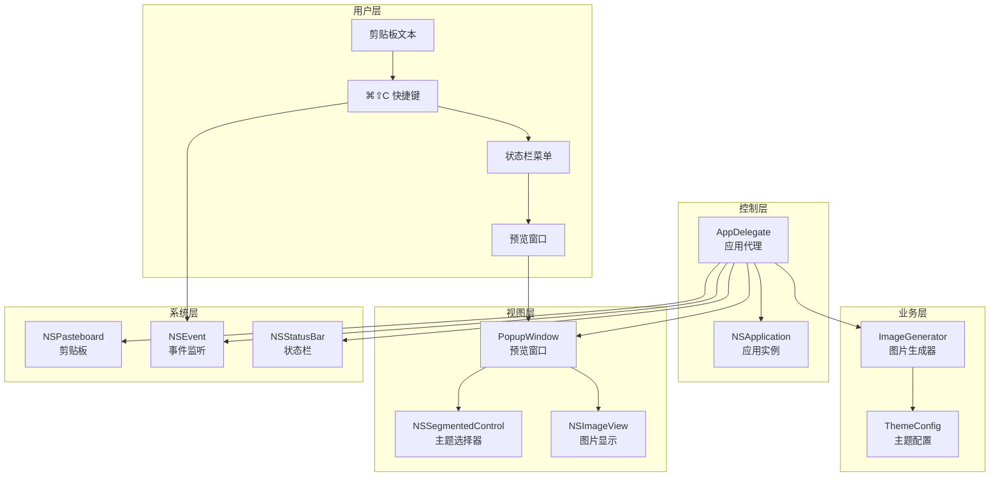
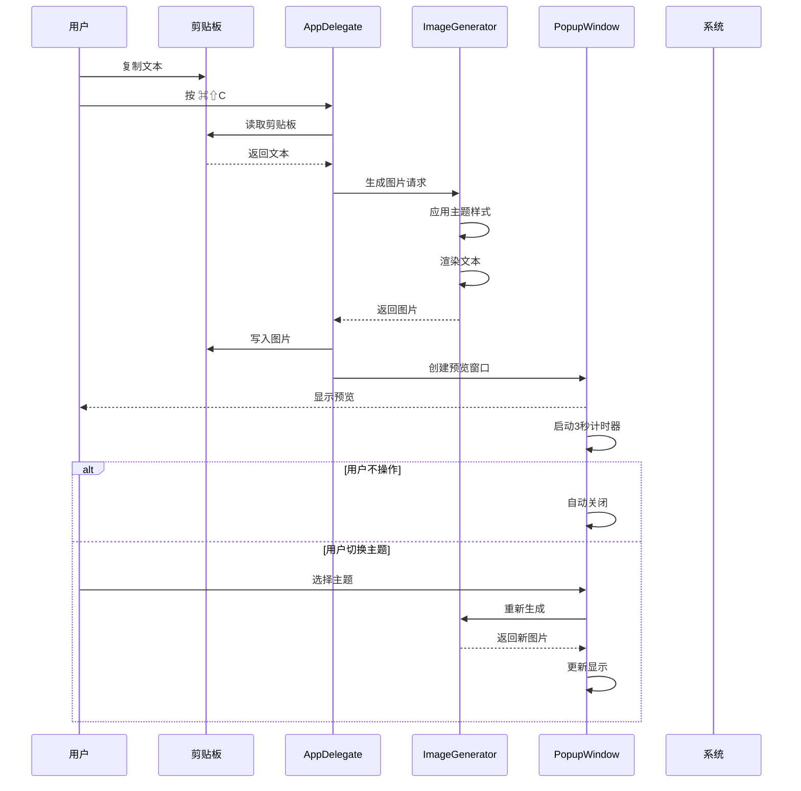

# 架构设计

## 🏗️ 整体架构

TextToShare 采用了经典的 MVC（Model-View-Controller）架构模式，并结合了 macOS 应用特有的委托模式。整个应用设计简洁明了，各模块职责清晰。

### 架构图



## 📦 模块划分

### 1. AppDelegate（应用控制器）
**文件**: `AppDelegate.swift`

**职责**:
- 应用生命周期管理
- 全局快捷键注册与处理
- 状态栏菜单管理
- 剪贴板监听与处理
- 窗口创建与管理

**核心方法**:
```swift
class AppDelegate: NSObject, NSApplicationDelegate {
    // 应用启动
    func applicationDidFinishLaunching(_ notification: Notification)

    // 快捷键处理
    func generateImage(_ sender: Any?)

    // 状态栏菜单
    func setupStatusBarMenu()

    // 日志记录
    func log(_ message: String)
}
```

### 2. ImageGenerator（图片生成引擎）
**文件**: `ImageGenerator.swift`

**职责**:
- 文本到图片的转换
- 主题样式管理
- 图片尺寸计算
- 渲染优化

**核心方法**:
```swift
class ImageGenerator {
    // 生成图片
    func generateImage(from text: String, theme: Theme) -> NSImage?

    // 计算尺寸
    private func calculateImageSize(for text: String) -> NSSize

    // 应用主题
    private func applyTheme(config: ThemeConfig, to rect: NSRect)
}
```

### 3. PopupWindow（预览窗口）
**文件**: `PopupWindow.swift`

**职责**:
- 图片预览显示
- 主题切换界面
- 图片保存功能
- 用户交互处理

**核心方法**:
```swift
class PopupWindow: NSWindow {
    // 初始化
    init(image: NSImage, text: String)

    // 主题切换
    @objc private func themeChanged(_ sender: NSSegmentedControl)

    // 保存图片
    @objc private func saveImage(_ sender: NSButton)

    // 安全关闭
    func safeClose()
}
```

### 4. main（程序入口）
**文件**: `main.swift`

**职责**:
- 创建应用实例
- 设置应用代理
- 启动主循环

## 🎨 设计模式应用

### 1. 委托模式（Delegate Pattern）
应用广泛使用 macOS 的委托模式：
- `NSApplicationDelegate` 处理应用生命周期
- `NSWindowDelegate` 管理窗口事件

### 2. 单例模式（Singleton）
- `NSApplication.shared` - 全局应用实例
- `NSPasteboard.general` - 系统剪贴板

### 3. 工厂模式（Factory）
- `ThemeConfig.config(for:)` 根据主题类型创建配置

### 4. 观察者模式（Observer）
- 快捷键事件监听
- 窗口关闭计时器

## 🔄 数据流向

### 生成图片的完整流程



### 关键数据结构

#### Theme 主题枚举
```swift
enum Theme {
    case light      // 浅色主题
    case dark       // 深色主题
    case gradient   // 渐变主题
}
```

#### ThemeConfig 主题配置
```swift
struct ThemeConfig {
    let backgroundColor: NSColor
    let textColor: NSColor
    let borderColor: NSColor?
    let cornerRadius: CGFloat
}
```

## 🏛️ 架构决策说明

### 1. 为什么选择 LSUIElement？
**决策**: 设置 `LSUIElement = true`

**原因**:
- 应用作为工具性质，不需要在 Dock 显示
- 减少用户界面的复杂度
- 符合"快速工具"的定位

**权衡**:
- ✅ 用户体验简洁
- ✅ 资源占用低
- ❌ 需要状态栏菜单作为主要入口

### 2. 为什么使用命令行编译？
**决策**: 使用 `swiftc` 而非 Xcode 项目

**原因**:
- 项目规模小，不需要复杂的配置
- 构建脚本简单直接
- 便于自动化构建

**权衡**:
- ✅ 构建简单
- ✅ 无 IDE 依赖
- ❌ 调试相对困难
- ❌ 缺少图形界面配置

### 3. 为什么分离图片生成逻辑？
**决策**: 创建独立的 `ImageGenerator` 类

**原因**:
- 单一职责原则
- 便于单元测试
- 易于扩展和复用

**好处**:
- 代码组织清晰
- 逻辑独立
- 便于维护

### 4. 为什么使用委托而非闭包？
**决策**: 使用传统的委托模式

**原因**:
- macOS 标准实践
- 避免循环引用
- 代码可读性好

## 🔧 扩展性设计

### 1. 主题系统扩展
```swift
// 添加新主题只需：
enum Theme {
    case light
    case dark
    case gradient
    case custom  // 新增自定义主题
}

// 在 ThemeConfig 中添加对应配置
static func config(for theme: Theme) -> ThemeConfig {
    switch theme {
    // ... 现有主题
    case .custom:
        return ThemeConfig(...)
    }
}
```

### 2. 输出格式扩展
```swift
// 添加支持更多格式
enum ImageFormat {
    case png
    case jpeg
    case heic  // 新增格式
}
```

### 3. 功能模块扩展
- 添加历史记录功能
- 支持批量处理
- 添加图片编辑功能

## 📊 性能优化

### 1. 内存管理
- 使用 `weak` 引用避免循环引用
- 及时释放不需要的资源
- 对象池复用（可扩展）

### 2. 渲染优化
- 缓存计算结果
- 避免重复绘制
- 使用硬件加速

### 3. 响应优化
- 异步处理长时间操作
- 防抖动处理快速操作
- 预加载常用资源

## 🛡️ 错误处理

### 1. 剪贴板错误
```swift
guard let text = clipboard.string(forType: .string) else {
    log("剪贴板中没有文本")
    return
}
```

### 2. 图片生成错误
```swift
guard let image = generateImage(from: text) else {
    log("图片生成失败")
    return
}
```

### 3. 窗口管理错误
```swift
func safeClose() {
    DispatchQueue.main.async { [weak self] in
        guard let self = self else { return }
        if self.isVisible {
            self.orderOut(nil)
        }
    }
}
```

## 📚 相关文档

- [应用代理](04-app-delegate.md) - 了解控制器的详细实现
- [图片生成](05-image-generator.md) - 学习生成引擎的内部机制
- [预览窗口](06-popup-window.md) - 掌握 UI 组件的实现

---

**下一步：建议阅读 [程序入口](03-main-entry.md) 来了解应用的启动流程。**