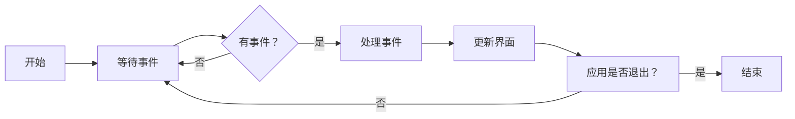
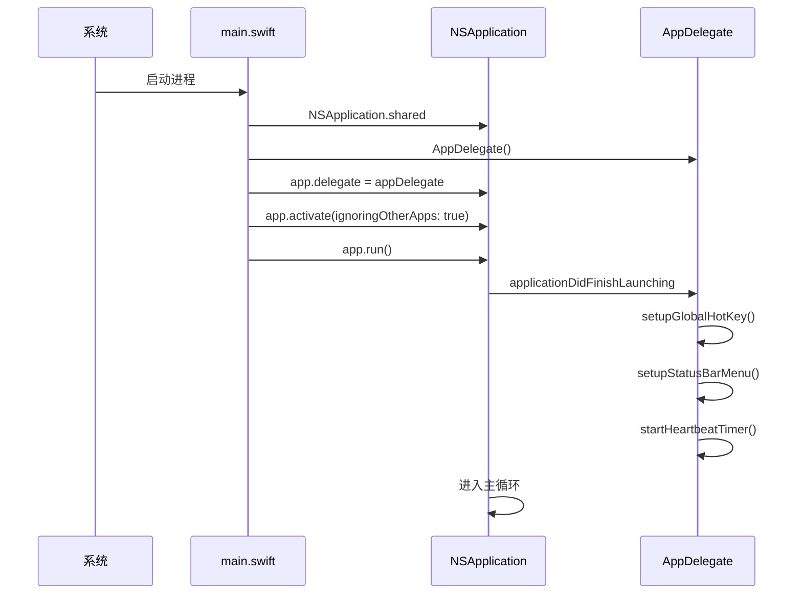

# 程序入口分析

## 🚀 main.swift 详解

`main.swift` 是整个 TextToShare 应用的入口点。虽然代码非常简洁，但每一行都承担着重要的初始化职责。

### 完整代码

```swift
import Cocoa

// 1. 创建应用实例
let app = NSApplication.shared

// 2. 创建并设置应用代理
let appDelegate = AppDelegate()
app.delegate = appDelegate

// 3. 激活应用
app.activate(ignoringOtherApps: true)

// 4. 运行应用主循环
app.run()
```

## 📝 逐行解析

### 1. 导入 Cocoa 框架

```swift
import Cocoa
```

**作用**: 导入 Cocoa 框架，这是 macOS 应用开发的基础框架。

**包含内容**:
- `NSApplication` - 应用程序类
- `NSWindow` - 窗口类
- `NSView` - 视图类
- `NSMenu` - 菜单类
- 事件处理系统
- 图形渲染系统
- 以及其他所有 macOS 应用开发所需的类

### 2. 获取应用实例

```swift
let app = NSApplication.shared
```

**作用**: 获取 NSApplication 的单例实例。

**详细说明**:
- `NSApplication.shared` 返回全局唯一的应用实例
- 这是整个应用的中央控制点
- 负责管理应用的生命周期
- 处理系统级事件
- 管理窗口和菜单

**内部机制**:
```swift
// NSApplication.shared 的简化实现
public class NSApplication {
    private static var _shared: NSApplication?

    public static var shared: NSApplication {
        if _shared == nil {
            _shared = NSApplication()
        }
        return _shared!
    }
}
```

### 3. 创建应用代理

```swift
let appDelegate = AppDelegate()
app.delegate = appDelegate
```

**作用**: 创建 AppDelegate 实例并设置为应用的代理。

**详细说明**:

#### AppDelegate 的职责
- 管理应用的生命周期
- 响应系统级事件
- 处理应用启动和退出
- 管理状态栏
- 处理全局快捷键

#### 代理模式的优势
- 将应用逻辑与应用框架分离
- 提供清晰的扩展点
- 便于测试和维护
- 符合 Cocoa 的设计模式

#### 委托关系建立
```swift
// NSApplication.delegate 的类型
weak open var delegate: NSApplicationDelegate?

// AppDelegate 遵循的协议
class AppDelegate: NSObject, NSApplicationDelegate {
    // 实现协议方法
}
```

### 4. 激活应用

```swift
app.activate(ignoringOtherApps: true)
```

**作用**: 将应用带到前台并激活。

**参数说明**:
- `ignoringOtherApps: true` - 强制激活，忽略其他应用的状态

**效果**:
- 应用成为前台应用
- 菜单栏显示应用的菜单
- 键盘事件可以发送到应用
- 用户可以看到应用的界面（如果有）

**使用场景**:
对于 LSUIElement 应用，这个调用：
- 不会显示 Dock 图标
- 不会显示应用窗口（因为还没有创建）
- 但会激活应用，使其能接收键盘事件

### 5. 运行主循环

```swift
app.run()
```

**作用**: 启动应用的主事件循环。

**详细说明**:

#### 主循环的工作


#### 事件类型
- 鼠标事件（点击、移动、拖拽）
- 键盘事件（按键、快捷键）
- 窗口事件（创建、关闭、调整大小）
- 定时器事件
- 系统事件（睡眠、唤醒）

#### 阻塞特性
`app.run()` 是一个**阻塞调用**，它会：
- 阻塞当前线程
- 直到应用退出才返回
- 这就是 main.swift 中它作为最后一句的原因

## 🔄 应用启动流程

### 完整的启动序列



### 启动阶段详解

#### 阶段 1: 应用实例化
```swift
// 这一步内部会：
// 1. 创建 NSApplication 实例
// 2. 初始化应用框架
// 3. 设置默认配置
// 4. 连接到窗口服务器
let app = NSApplication.shared
```

#### 阶段 2: 代理设置
```swift
// 这一步会：
// 1. 创建 AppDelegate 实例
// 2. 建立代理关系
// 3. 准备接收生命周期回调
let appDelegate = AppDelegate()
app.delegate = appDelegate
```

#### 阶段 3: 应用激活
```swift
// 这一步会：
// 1. 将应用设置为前台应用
// 2. 准备接收用户输入
// 3. 显示菜单栏（如果有）
app.activate(ignoringOtherApps: true)
```

#### 阶段 4: 主循环启动
```swift
// 这一步会：
// 1. 触发 applicationDidFinishLaunching
// 2. 开始处理事件
// 3. 保持应用运行
app.run()
```

## 🆚 与其他启动方式的比较

### 1. Storyboard 应用启动
```swift
// 使用 Storyboard 的典型启动代码
import Cocoa

@main
class AppDelegate: NSObject, NSApplicationDelegate {
    @IBOutlet var window: NSWindow!

    func applicationDidFinishLaunching(_ aNotification: Notification) {
        // 窗口自动从 Storyboard 加载
    }
}
```

**区别**:
- 使用 `@main` 属性
- 界面从 Storyboard 加载
- 更适合复杂的多窗口应用

### 2. SwiftUI 应用启动
```swift
import SwiftUI

@main
struct TextToShareApp: App {
    var body: some Scene {
        WindowGroup {
            ContentView()
        }
    }
}
```

**区别**:
- 使用 SwiftUI 框架
- 声明式界面定义
- 适合现代化的应用设计

### 3. 本项目的选择理由

选择传统的程序化启动方式的原因：

1. **简洁性**: 项目功能单一，不需要复杂的界面
2. **控制力**: 程序化控制更精确
3. **兼容性**: 兼容旧版 macOS
4. **学习价值**: 更好地理解底层机制

## 🔧 启动配置

### Info.plist 关键配置

```xml
<key>LSUIElement</key>
<true/>
```

**效果**:
- 应用不在 Dock 显示
- 启动时不创建默认窗口
- 作为后台服务运行

```xml
<key>NSPrincipalClass</key>
<string>NSApplication</string>
```

**作用**: 指定主应用类

## 🐛 常见问题

### 1. 应用启动后立即退出
**原因**:
- 没有保持运行的组件
- LSUIElement 配置问题

**解决**:
```swift
// AppDelegate 中保持活跃
let timer = Timer.scheduledTimer(withTimeInterval: 10.0, repeats: true) { _ in
    // 保持应用活跃
}
```

### 2. 无法接收快捷键
**原因**:
- 应用没有正确激活
- 事件监听设置错误

**解决**:
```swift
// 确保应用激活
app.activate(ignoringOtherApps: true)

// 使用正确的事件监听
NSEvent.addLocalMonitorForEvents(matching: .keyDown) { event in
    // 处理快捷键
}
```

### 3. 崩溃在启动阶段
**原因**:
- 导入缺失
- 初始化顺序错误

**解决**:
```swift
// 检查所有必要的导入
import Cocoa
import Foundation

// 确保正确的初始化顺序
let app = NSApplication.shared  // 先获取实例
let appDelegate = AppDelegate() // 再创建代理
app.delegate = appDelegate      // 最后设置代理
```

## 📚 相关文档

- [应用代理](04-app-delegate.md) - 了解 AppDelegate 的详细实现
- [构建系统](07-build-system.md) - 学习编译和打包流程

---

**下一步：建议阅读 [应用代理](04-app-delegate.md) 来了解应用的核心控制器实现。**