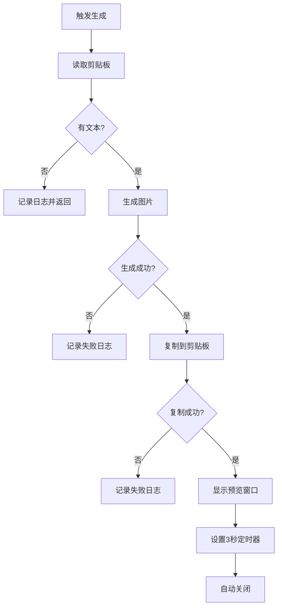

# 应用代理详解

## 🎮 AppDelegate 核心控制器

`AppDelegate` 是 TextToShare 应用的核心控制器，负责整个应用的生命周期管理、用户交互处理和系统服务集成。作为 `NSApplicationDelegate` 的实现，它是连接用户操作和系统功能的关键桥梁。

## 📋 类结构概览

```swift
class AppDelegate: NSObject, NSApplicationDelegate {
    // MARK: - Properties
    private var statusItem: NSStatusItem?
    private var imageGenerator: ImageGenerator
    private var heartbeatTimer: Timer?

    // MARK: - NSApplicationDelegate
    func applicationDidFinishLaunching(_ notification: Notification)
    func applicationWillTerminate(_ notification: Notification)
    func applicationShouldHandleReopen(_ sender: NSApplication, hasVisibleWindows flag: Bool) -> Bool

    // MARK: - Core Functions
    @objc private func generateImage(_ sender: Any?)
    @objc private func quitApp(_ sender: Any?)

    // MARK: - Setup Methods
    private func setupGlobalHotKey()
    private func setupStatusBarMenu()
    private func startHeartbeatTimer()

    // MARK: - Utilities
    func log(_ message: String)
}
```

## 🚀 应用启动流程

### applicationDidFinishLaunching 详解

```swift
func applicationDidFinishLaunching(_ notification: Notification) {
    log("应用启动完成")

    // 1. 设置为后台应用
    NSApp.setActivationPolicy(.accessory)

    // 2. 初始化图片生成器
    imageGenerator = ImageGenerator()

    // 3. 设置全局快捷键
    setupGlobalHotKey()

    // 4. 设置状态栏菜单
    setupStatusBarMenu()

    // 5. 启动心跳计时器
    startHeartbeatTimer()

    log("所有组件初始化完成")
}
```

#### 步骤解析

1. **设置后台应用模式**
   ```swift
   NSApp.setActivationPolicy(.accessory)
   ```
   - `.accessory`: 应用不会出现在 Dock 中
   - 适合工具类应用
   - 保持后台运行特性

2. **初始化核心组件**
   ```swift
   imageGenerator = ImageGenerator()
   ```
   - 创建图片生成器实例
   - 准备处理文本转换任务

3. **配置用户交互**
   ```swift
   setupGlobalHotKey()    // ⌘⇧C 快捷键
   setupStatusBarMenu()   // 状态栏菜单
   ```
   - 建立主要交互方式
   - 提供可视化入口

4. **维护应用活跃**
   ```swift
   startHeartbeatTimer()
   ```
   - 定期检查应用状态
   - 防止系统休眠杀死应用

## ⌨️ 全局快捷键实现

### 快捷键注册机制

```swift
private func setupGlobalHotKey() {
    // 使用本地事件监听器
    NSEvent.addLocalMonitorForEvents(matching: .keyDown) { [weak self] event in
        // 检查修饰键
        guard event.modifierFlags.contains([.command, .shift]) else {
            return event
        }

        // 检查按键 (keyCode 8 = C键)
        if event.keyCode == 8 {
            DispatchQueue.main.async {
                self?.generateImage(nil)
            }
            return nil // 消费此事件
        }

        return event
    }

    log("全局快捷键 ⌘⇧C 已注册")
}
```

#### 技术细节

1. **事件类型选择**
   - `NSEvent.addLocalMonitorForEvents`: 监听应用内事件
   - 不需要辅助功能权限
   - 更可靠和稳定

2. **按键识别**
   ```swift
   // 键码对应关系
   // 8 = C键
   // 7 = B键
   // 9 = V键
   event.keyCode == 8
   ```

3. **修饰键检查**
   ```swift
   // Command + Shift
   event.modifierFlags.contains([.command, .shift])
   ```

4. **线程安全**
   ```swift
   // 确保在主线程处理 UI
   DispatchQueue.main.async {
       self?.generateImage(nil)
   }
   ```

### 其他实现方案对比

#### 方案 1: Carbon Hot Keys
```swift
// 需要导入 Carbon
import Carbon

var hotKeyRef: EventHotKeyRef?
let hotKeyID = EventHotKeyID(signature: OSType(0x68747323), id: 1)

RegisterEventHotKey(
    8, // keyCode for C
    UInt32(cmdKey | shiftKey),
    hotKeyID,
    GetApplicationEventTarget(),
    0,
    &hotKeyRef
)
```
**缺点**:
- API 已废弃
- 需要处理 C 语言回调
- 内存管理复杂

#### 方案 2: 全局监听
```swift
NSEvent.addGlobalMonitorForEvents(matching: .keyDown) { event in
    // 处理全局按键
}
```
**缺点**:
- 需要辅助功能权限
- 可能被安全软件拦截
- 影响系统性能

## 📊 状态栏菜单

### 菜单结构设计

```swift
private func setupStatusBarMenu() {
    // 1. 创建状态栏项
    statusItem = NSStatusBar.system.statusItem(withLength: NSStatusItem.variableLength)

    // 2. 设置图标
    statusItem?.button?.title = "📝"
    statusItem?.button?.toolTip = "文字分享图生成器"

    // 3. 创建菜单
    let menu = NSMenu()

    // 4. 添加菜单项
    menu.addItem(NSMenuItem(title: "生成分享图",
                          action: #selector(generateImage(_:)),
                          keyEquivalent: ""))
    menu.addItem(NSMenuItem.separator())
    menu.addItem(NSMenuItem(title: "退出",
                          action: #selector(quitApp(_:)),
                          keyEquivalent: "q"))

    // 5. 设置菜单
    statusItem?.menu = menu

    log("状态栏菜单已设置")
}
```

#### 设计要点

1. **图标选择**
   - 📝 emoji：直观表示文本功能
   - 无需额外图片资源
   - 跨平台一致性好

2. **菜单项组织**
   ```swift
   生成分享图  // 主要功能
   ----------   // 分隔线
   退出        // 系统操作
   ```

3. **快捷键支持**
   ```swift
   // 退出菜单支持 Cmd+Q
   keyEquivalent: "q"
   ```

4. **工具提示**
   ```swift
   // 鼠标悬停显示说明
   toolTip = "文字分享图生成器"
   ```

## 🔄 核心功能实现

### generateImage 函数详解

```swift
@objc private func generateImage(_ sender: Any?) {
    log("触发图片生成")

    // 1. 获取剪贴板
    let clipboard = NSPasteboard.general

    // 2. 读取文本
    guard let text = clipboard.string(forType: .string), !text.isEmpty else {
        log("剪贴板中没有文本内容")
        return
    }

    log("读取到文本: \(text.prefix(50))...")

    // 3. 生成图片（使用浅色主题）
    guard let image = imageGenerator.generateImage(from: text, theme: .light) else {
        log("图片生成失败")
        return
    }

    log("图片生成成功，尺寸: \(image.size)")

    // 4. 复制图片到剪贴板
    let imagePasteboard = NSPasteboard.general
    imagePasteboard.clearContents()
    let success = imagePasteboard.writeObjects([image])

    if success {
        log("图片已复制到剪贴板")

        // 5. 显示预览窗口
        DispatchQueue.main.async { [weak self] in
            if let window = PopupWindow(image: image, text: text) {
                window.makeKeyAndOrderFront(nil)

                // 6. 设置3秒后自动关闭
                DispatchQueue.main.asyncAfter(deadline: .now() + 3.0) {
                    window.safeClose()
                }
            }
        }
    } else {
        log("图片复制失败")
    }
}
```

#### 处理流程解析



## 💓 心跳机制

### 定时器实现

```swift
private func startHeartbeatTimer() {
    heartbeatTimer = Timer.scheduledTimer(withTimeInterval: 10.0, repeats: true) { [weak self] _ in
        self?.log("应用心跳 - 确认应用仍在运行")
    }

    log("心跳计时器已启动 (10秒间隔)")
}
```

#### 设计目的

1. **保持应用活跃**
   - 防止系统在长时间无活动时终止应用
   - 特别适用于后台服务

2. **调试支持**
   - 定期输出日志确认应用状态
   - 便于问题诊断

3. **内存提醒**
   - 使用 `weak self` 避免循环引用
   - 正确处理定时器生命周期

#### 内存管理

```swift
// AppDelegate 销毁时清理
deinit {
    heartbeatTimer?.invalidate()
    heartbeatTimer = nil
    log("AppDelegate 已销毁")
}

// 应用终止时清理
func applicationWillTerminate(_ notification: Notification) {
    heartbeatTimer?.invalidate()
    log("应用即将终止")
}
```

## 📝 日志系统

### 统一日志接口

```swift
func log(_ message: String) {
    let formatter = DateFormatter()
    formatter.dateFormat = "yyyy-MM-dd HH:mm:ss.SSS"
    let timestamp = formatter.string(from: Date())

    print("[\(timestamp)] [TextToShare] \(message)")
}
```

#### 日志格式
```
[2024-01-08 14:30:25.123] [TextToShare] 应用启动完成
[2024-01-08 14:30:25.125] [TextToShare] 全局快捷键 ⌘⇧C 已注册
[2024-01-08 14:30:25.126] [TextToShare] 状态栏菜单已设置
[2024-01-08 14:30:25.127] [TextToShare] 心跳计时器已启动 (10秒间隔)
[2024-01-08 14:30:35.128] [TextToShare] 应用心跳 - 确认应用仍在运行
```

#### 日志级别设计

可扩展为分级日志系统：
```swift
enum LogLevel {
    case debug, info, warning, error
}

func log(_ message: String, level: LogLevel = .info) {
    switch level {
    case .debug:
        // 仅在 Debug 模式输出
    case .info:
        // 正常信息
    case .warning:
        // 警告信息，可添加 ⚠️ 前缀
    case .error:
        // 错误信息，可添加 ❌ 前缀
    }
}
```

## 🔄 生命周期管理

### 完整的生命周期方法

```swift
// 1. 应用启动完成
func applicationDidFinishLaunching(_ notification: Notification) {
    // 初始化所有组件
}

// 2. 应用即将终止
func applicationWillTerminate(_ notification: Notification) {
    log("应用即将终止")
    heartbeatTimer?.invalidate()
}

// 3. 用户重新打开应用（如点击 Dock 图标）
func applicationShouldHandleReopen(_ sender: NSApplication, hasVisibleWindows flag: Bool) -> Bool {
    if !flag {
        // 没有可见窗口时，显示主窗口或触发主功能
        generateImage(nil)
    }
    return true
}

// 4. 应用隐藏
func applicationWillHide(_ notification: Notification) {
    log("应用即将隐藏")
}

// 5. 应用取消隐藏
func applicationWillUnhide(_ notification: Notification) {
    log("应用即将取消隐藏")
}
```

## 🛡️ 错误处理

### 常见错误场景

1. **剪贴板访问失败**
   ```swift
   guard let text = clipboard.string(forType: .string) else {
       log("剪贴板访问失败或无内容")
       return
   }
   ```

2. **图片生成失败**
   ```swift
   guard let image = imageGenerator.generateImage(from: text, theme: .light) else {
       log("图片生成失败")
       return
   }
   ```

3. **窗口创建失败**
   ```swift
   guard let window = PopupWindow(image: image, text: text) else {
       log("预览窗口创建失败")
       return
   }
   ```

### 防御性编程

```swift
// 1. 使用 weak 引用
NSEvent.addLocalMonitorForEvents(matching: .keyDown) { [weak self] event in
    // 避免循环引用
}

// 2. 检查可选值
statusItem?.button?.title = "📝"

// 3. 主线程检查
DispatchQueue.main.async {
    // UI 操作必须在主线程
}

// 4. 资源清理
deinit {
    heartbeatTimer?.invalidate()
    heartbeatTimer = nil
}
```

## 📚 相关文档

- [图片生成](05-image-generator.md) - 了解图片生成的详细实现
- [剪贴板集成](09-clipboard-integration.md) - 深入学习剪贴板操作
- [预览窗口](06-popup-window.md) - 掌握窗口管理技术

---

**下一步：建议阅读 [图片生成](05-image-generator.md) 来学习核心的图片处理技术。**