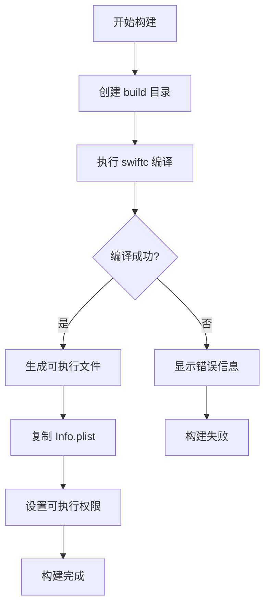

# 构建系统详解

## 🔨 Build System Overview

TextToShare 采用轻量级的构建系统，使用 Swift 命令行编译器直接编译，无需复杂的 Xcode 项目配置。这种构建方式简洁高效，特别适合小型工具类应用。

## 📁 构建文件结构

```
TextToShare/
├── build.sh              # 构建脚本
├── Info.plist           # 应用配置文件
├── .gitignore          # Git 忽略配置
└── build/              # 构建输出目录
    ├── *.o             # 目标文件（编译临时文件）
    └── TextToShare     # 最终可执行文件
```

## 🛠️ 构建脚本详解

### build.sh 完整代码

```bash
#!/bin/bash

# TextToShare 构建脚本

# 1. 设置变量
SWIFT_FILES="*.swift"
OUTPUT_DIR="build"
EXECUTABLE_NAME="TextToShare"

# 2. 创建构建目录
echo "创建构建目录..."
mkdir -p $OUTPUT_DIR

# 3. 编译 Swift 文件
echo "编译 Swift 文件..."
swiftc -o $OUTPUT_DIR/$EXECUTABLE_NAME \
       -framework Cocoa \
       $SWIFT_FILES

# 4. 检查编译结果
if [ $? -eq 0 ]; then
    echo "✅ 构建成功！"
    echo "可执行文件位置: $OUTPUT_DIR/$EXECUTABLE_NAME"
    echo ""
    echo "运行应用: ./$OUTPUT_DIR/$EXECUTABLE_NAME"
    echo ""
    echo "使用说明："
    echo "- 复制文本到剪贴板"
    echo "- 按 ⌘⇧C 生成分享图片"
    echo "- 查看 docs/ 文件夹了解更多"
else
    echo "❌ 构建失败"
    exit 1
fi
```

### 构建命令解析

#### swiftc 编译参数

```bash
swiftc -o build/TextToShare \
       -framework Cocoa \
       *.swift
```

**参数说明**:

1. **`-o build/TextToShare`**
   - 指定输出文件路径
   - `-o` 表示 output
   - `build/TextToShare` 是输出路径

2. **`-framework Cocoa`**
   - 链接 Cocoa 框架
   - 提供 macOS 应用开发所需的基础类
   - 包括 NSApplication、NSWindow、NSView 等

3. **`*.swift`**
   - 编译所有 Swift 源文件
   - 按字母顺序编译
   - 自动处理文件依赖关系

#### 其他有用的编译选项

```bash
# 启用优化（Release 模式）
swiftc -O -o build/TextToShare -framework Cocoa *.swift

# 生成调试信息（Debug 模式）
swiftc -g -o build/TextToShare -framework Cocoa *.swift

# 启用所有警告
swiftc -warnings-as-errors -o build/TextToShare -framework Cocoa *.swift

# 指定目标版本
swiftc -target x86_64-apple-macos13.0 -o build/TextToShare -framework Cocoa *.swift

# 并行编译
swiftc -j $(nproc) -o build/TextToShare -framework Cocoa *.swift
```

## ⚙️ Info.plist 配置

### 完整配置文件

```xml
<?xml version="1.0" encoding="UTF-8"?>
<!DOCTYPE plist PUBLIC "-//Apple//DTD PLIST 1.0//EN" "http://www.apple.com/DTDs/PropertyList-1.0.dtd">
<plist version="1.0">
<dict>
    <!-- 基本信息 -->
    <key>CFBundleDevelopmentRegion</key>
    <string>zh_CN</string>

    <key>CFBundleExecutable</key>
    <string>$(EXECUTABLE_NAME)</string>

    <key>CFBundleIdentifier</key>
    <string>com.example.TextToShare</string>

    <key>CFBundleName</key>
    <string>文字分享图</string>

    <key>CFBundleDisplayName</key>
    <string>文字分享图生成器</string>

    <!-- 版本信息 -->
    <key>CFBundleShortVersionString</key>
    <string>1.0</string>

    <key>CFBundleVersion</key>
    <string>1</string>

    <!-- 系统要求 -->
    <key>LSMinimumSystemVersion</key>
    <string>13.0</string>

    <!-- 应用类型 -->
    <key>LSUIElement</key>
    <true/>

    <key>NSPrincipalClass</key>
    <string>NSApplication</string>

    <!-- 图标配置 -->
    <key>CFBundleIconFile</key>
    <string></string>

    <!-- 权限声明 -->
    <key>NSCameraUsageDescription</key>
    <string>此应用不需要访问相机</string>

    <key>NSMicrophoneUsageDescription</key>
    <string>此应用不需要访问麦克风</string>

    <!-- 安全配置 -->
    <key>NSAppTransportSecurity</key>
    <dict>
        <key>NSAllowsArbitraryLoads</key>
        <true/>
    </dict>

    <!-- 硬件要求 -->
    <key>NSSupportsAutomaticGraphicsSwitching</key>
    <true/>

    <!-- 分类 -->
    <key>LSApplicationCategoryType</key>
    <string>public.app-category.utilities</string>
</dict>
</plist>
```

### 关键配置详解

#### 1. LSUIElement 配置

```xml
<key>LSUIElement</key>
<true/>
```

**作用**:
- 应用不在 Dock 中显示图标
- 没有 Dock 菜单栏
- 切换应用时不会显示
- 适合后台工具应用

**影响**:
- 应用启动后不可见（除非有窗口）
- 必须通过状态栏菜单或快捷键交互
- Cmd+Tab 应用切换器中不显示

#### 2. 权限声明

```xml
<key>NSCameraUsageDescription</key>
<string>此应用不需要访问相机</string>
```

**说明**:
- 明确声明不需要某些权限
- 提高用户信任度
- 避免 App Store 审核问题

#### 3. 网络安全配置

```xml
<key>NSAppTransportSecurity</key>
<dict>
    <key>NSAllowsArbitraryLoads</key>
    <true/>
</dict>
```

**注意**:
- 虽然允许任意加载，但应用实际不使用网络
- 可考虑更严格的配置

## 🔄 构建流程图



## 🚀 构建命令使用

### 基本构建

```bash
# 1. 给脚本执行权限
chmod +x build.sh

# 2. 运行构建脚本
./build.sh
```

### 手动构建

```bash
# 直接使用 swiftc 编译
mkdir -p build
swiftc -o build/TextToShare -framework Cocoa *.swift
```

### 开发模式构建

```bash
# 开发模式（带调试信息）
swiftc -g -o build/TextToShare -framework Cocoa *.swift
```

### 发布模式构建

```bash
# 发布模式（带优化）
swiftc -O -o build/TextToShare -framework Cocoa *.swift
```

## 📦 打包和分发

### 创建应用包

```bash
#!/bin/bash
# package.sh - 创建 .app 应用包

APP_NAME="TextToShare"
APP_PATH="build/$APP_NAME.app"
CONTENTS_PATH="$APP_PATH/Contents"
MACOS_PATH="$CONTENTS_PATH/MacOS"
RESOURCES_PATH="$CONTENTS_PATH/Resources"

# 1. 创建应用包结构
mkdir -p "$MACOS_PATH"
mkdir -p "$RESOURCES_PATH"

# 2. 复制可执行文件
cp build/TextToShare "$MACOS_PATH/"

# 3. 复制 Info.plist
cp Info.plist "$CONTENTS_PATH/"

# 4. 设置可执行权限
chmod +x "$MACOS_PATH/TextToShare"

# 5. 创建 PkgInfo
echo "APPL????" > "$CONTENTS_PATH/PkgInfo"

echo "✅ 应用包创建完成: $APP_PATH"
```

### 创建 DMG 安装包

```bash
#!/bin/bash
# create-dmg.sh - 创建 DMG 安装包

DMG_NAME="TextToShare-1.0"
SOURCE="build/TextToShare.app"
DMG_PATH="build/$DMG_NAME.dmg"

# 1. 创建临时 DMG
hdiutil create -srcfolder "$SOURCE" -volname "$DMG_NAME" -fs HFS+ \
    -fsargs "-c c=64,a=16,e=16" -format UDRW -size 100m pack.temp.dmg

# 2. 挂载临时 DMG
device=$(hdiutil attach -readwrite -noverify -noautoopen "pack.temp.dmg" | \
    egrep '^/dev/' | sed 1q | awk '{print $1}')

# 3. 配置 DMG
echo '
tell application "Finder"
    tell disk "'$DMG_NAME'"
        open
        set current view of container window to icon view
        set toolbar visible of container window to false
        set statusbar visible of container window to false
        set the bounds of container window to {400, 100, 920, 440}
        set theViewOptions to the icon view options of container window
        set arrangement of theViewOptions to not arranged
        set icon size of theViewOptions to 72
        make new alias file at container window to POSIX file "/Applications" with properties {name:"Applications"}
        set position of item "TextToShare" of container window to {150, 200}
        set position of item "Applications" of container window to {380, 200}
        close
        open
        update without registering applications
        delay 2
    end tell
end tell
' | osascript

# 4. 卸载临时 DMG
hdiutil detach $device

# 5. 创建最终 DMG
hdiutil convert "pack.temp.dmg" -format UDZO -imagekey zlib-level=9 -o "$DMG_PATH"

# 6. 清理
rm -f pack.temp.dmg

echo "✅ DMG 创建完成: $DMG_PATH"
```

## 🔍 构建问题排查

### 1. 编译错误

**问题**: 找不到模块或类型

```bash
error: cannot find 'Cocoa' in scope
```

**解决**:
```bash
# 检查 Xcode 命令行工具
xcode-select --install

# 检查 Swift 版本
swift --version

# 重新安装 Xcode Command Line Tools
sudo xcode-select --reset
```

### 2. 链接错误

**问题**: 找不到符号

```bash
Undefined symbols for architecture x86_64:
  "_NSApplicationMain", referenced from...
```

**解决**:
```bash
# 确保链接 Cocoa 框架
swiftc -framework Cocoa *.swift

# 检查目标架构
swiftc -target x86_64-apple-macos13.0 -framework Cocoa *.swift
```

### 3. 权限问题

**问题**: 无法执行构建的文件

```bash
Permission denied: ./build/TextToShare
```

**解决**:
```bash
# 设置可执行权限
chmod +x build/TextToShare

# 或在构建脚本中添加
chmod +x $OUTPUT_DIR/$EXECUTABLE_NAME
```

### 4. Info.plist 问题

**问题**: 应用启动失败

**解决**:
```bash
# 验证 Info.plist 语法
plutil -lint Info.plist

# 检查关键配置
plutil -p Info.plist | grep LSUIElement
```

## 🔧 构建优化

### 1. 并行构建

```bash
# 使用多核编译
swiftc -j $(nproc) -o build/TextToShare -framework Cocoa *.swift
```

### 2. 增量编译

```bash
#!/bin/bash
# incremental-build.sh - 增量构建脚本

OUTPUT_DIR="build"
OBJECT_DIR="$OUTPUT_DIR/objects"
EXECUTABLE="$OUTPUT_DIR/TextToShare"

# 创建对象目录
mkdir -p "$OBJECT_DIR"

# 编译每个 .swift 文件为 .o 文件
for file in *.swift; do
    object="$OBJECT_DIR/${file%.swift}.o"
    if [ ! -f "$object" ] || [ "$file" -nt "$object" ]; then
        echo "编译 $file..."
        swiftc -c -o "$object" "$file"
    fi
done

# 链接所有 .o 文件
echo "链接..."
swiftc -o "$EXECUTABLE" -framework Cocoa "$OBJECT_DIR"/*.o
```

### 3. 交叉编译

```bash
# 为不同架构编译
# Intel Mac
swiftc -target x86_64-apple-macos13.0 -o build/TextToShare-intel -framework Cocoa *.swift

# Apple Silicon
swiftc -target arm64-apple-macos13.0 -o build/TextToShare-arm -framework Cocoa *.swift

# 创建通用二进制文件
lipo -create build/TextToShare-intel build/TextToShare-arm -output build/TextToShare-universal
```

## 📋 构建最佳实践

### 1. 版本管理

```bash
# 在构建脚本中包含版本信息
VERSION=$(git describe --tags --always)
echo "#define APP_VERSION @\"$VERSION\"" > version.h
```

### 2. 自动化测试

```bash
#!/bin/bash
# test-build.sh - 测试构建脚本

# 构建应用
./build.sh

# 运行测试
./build/TextToShare --test

# 检查内存泄漏
leaks --atExit -- ./build/TextToShare
```

### 3. 持续集成

```yaml
# .github/workflows/build.yml
name: Build

on: [push, pull_request]

jobs:
  build:
    runs-on: macos-latest
    steps:
    - uses: actions/checkout@v2
    - name: Build
      run: |
        chmod +x build.sh
        ./build.sh
```

## 📚 相关文档

- [程序入口](03-main-entry.md) - 了解应用启动流程
- [开发指南](10-development-guide.md) - 学习更多开发技巧

---

**下一步：建议阅读 [主题系统](08-themes-system.md) 来了解主题设计的实现细节。**