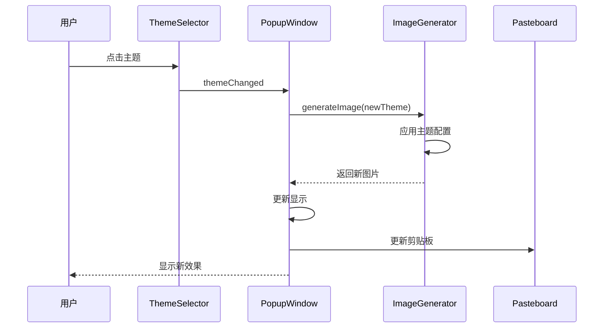

# 主题系统详解

## 🎨 Theme System Overview

TextToShare 的主题系统提供三种精心设计的视觉风格，满足不同场景的使用需求。系统采用模块化设计，易于扩展和维护，为用户提供美观且一致的视觉体验。

## 🎭 主题类型

### 1. 浅色主题（Light）
- **适用场景**: 日间使用、正式文档、打印输出
- **设计理念**: 简洁清晰，高对比度，适合阅读
- **色彩风格**: 白色背景，黑色文字，浅灰边框

### 2. 深色主题（Dark）
- **适用场景**: 夜间使用、代码分享、现代风格
- **设计理念**: 护眼舒适，减少视觉疲劳
- **色彩风格**: 深灰背景，白色文字，深灰边框

### 3. 渐变主题（Gradient）
- **适用场景**: 社交分享、创意内容、视觉突出
- **设计理念**: 优雅美观，视觉吸引力强
- **色彩风格**: 淡紫渐变背景，深紫文字，蓝紫边框

## 🏗️ 系统架构

### 核心组件

```swift
// 主题枚举
enum Theme: Int, CaseIterable {
    case light = 0
    case dark = 1
    case gradient = 2

    var name: String {
        switch self {
        case .light: return "浅色"
        case .dark: return "深色"
        case .gradient: return "渐变"
        }
    }
}

// 主题配置结构
struct ThemeConfig {
    let backgroundColor: NSColor
    let textColor: NSColor
    let borderColor: NSColor?
    let cornerRadius: CGFloat
    let borderWidth: CGFloat
    let shadowOpacity: Float
}
```

### 工厂模式实现

```swift
extension ThemeConfig {
    static func config(for theme: Theme) -> ThemeConfig {
        switch theme {
        case .light:
            return lightThemeConfig
        case .dark:
            return darkThemeConfig
        case .gradient:
            return gradientThemeConfig
        }
    }
}
```

## 🎨 主题配置详解

### 浅色主题配置

```swift
static let lightThemeConfig: ThemeConfig = ThemeConfig(
    backgroundColor: NSColor.white,
    textColor: NSColor.black,
    borderColor: NSColor.lightGray,
    cornerRadius: 8,
    borderWidth: 1,
    shadowOpacity: 0.1
)
```

#### 设计特点

1. **背景色**: `NSColor.white`
   - 纯白色背景 (RGB: 1.0, 1.0, 1.0)
   - 适合打印和正式场合
   - 与大多数应用界面风格一致

2. **文字色**: `NSColor.black`
   - 纯黑色文字 (RGB: 0.0, 0.0, 0.0)
   - 最高对比度，确保可读性
   - 适合各种屏幕显示

3. **边框色**: `NSColor.lightGray`
   - 浅灰色边框 (RGB: 0.83, 0.83, 0.83)
   - 提供边界定义而不抢夺注意力

### 深色主题配置

```swift
static let darkThemeConfig: ThemeConfig = ThemeConfig(
    backgroundColor: NSColor(red: 0.1, green: 0.1, blue: 0.1, alpha: 1.0),
    textColor: NSColor.white,
    borderColor: NSColor(red: 0.3, green: 0.3, blue: 0.3, alpha: 1.0),
    cornerRadius: 8,
    borderWidth: 1,
    shadowOpacity: 0.3
)
```

#### 设计特点

1. **背景色**: 深灰色
   - RGB 值: (0.1, 0.1, 0.1)
   - 不是纯黑，减少眼睛疲劳
   - 与深色模式系统主题协调

2. **文字色**: `NSColor.white`
   - 纯白色确保足够的对比度
   - 在深色背景上清晰可见

3. **边框色**: 中灰色
   - RGB 值: (0.3, 0.3, 0.3)
   - 提供柔和的边界定义

### 渐变主题配置

```swift
static let gradientThemeConfig: ThemeConfig = ThemeConfig(
    backgroundColor: NSColor(red: 0.95, green: 0.95, blue: 1.0, alpha: 1.0),
    textColor: NSColor(red: 0.1, green: 0.1, blue: 0.3, alpha: 1.0),
    borderColor: NSColor(red: 0.7, green: 0.7, blue: 1.0, alpha: 1.0),
    cornerRadius: 12,
    borderWidth: 2,
    shadowOpacity: 0.2
)
```

#### 设计特点

1. **背景色**: 淡紫色调
   - RGB 值: (0.95, 0.95, 1.0)
   - 柔和的蓝紫色调
   - 营造优雅的视觉氛围

2. **文字色**: 深蓝紫色
   - RGB 值: (0.1, 0.1, 0.3)
   - 与背景形成良好对比
   - 保持视觉和谐

3. **边框色**: 亮蓝紫色
   - RGB 值: (0.7, 0.7, 1.0)
   - 2px 边框宽度增强视觉层次

4. **圆角**: 12px
   - 比其他主题更圆润
   - 增强现代感

## 🎨 渐变实现

### 渐变背景绘制

```swift
private func drawGradientBackground(in rect: NSRect, config: ThemeConfig) {
    // 1. 创建渐变颜色
    let startColor = config.backgroundColor
    let endColor = NSColor(
        red: config.backgroundColor.redComponent * 0.9,
        green: config.backgroundColor.greenComponent * 0.9,
        blue: config.backgroundColor.blueComponent * 0.9,
        alpha: 1.0
    )

    // 2. 创建渐变对象
    guard let gradient = NSGradient(colors: [startColor, endColor]) else {
        return
    }

    // 3. 创建圆角路径
    let path = NSBezierPath(
        roundedRect: rect,
        xRadius: config.cornerRadius,
        yRadius: config.cornerRadius
    )

    // 4. 绘制渐变
    gradient.draw(in: path, angle: 45)

    // 5. 绘制边框
    if let borderColor = config.borderColor {
        borderColor.setStroke()
        path.lineWidth = config.borderWidth
        path.stroke()
    }
}
```

### 高级渐变效果（扩展）

```swift
// 多色渐变
private func drawMultiColorGradient(in rect: NSRect) {
    let colors = [
        NSColor(red: 0.95, green: 0.95, blue: 1.0, alpha: 1.0),  // 浅紫
        NSColor(red: 0.9, green: 0.9, blue: 0.98, alpha: 1.0),   // 中紫
        NSColor(red: 0.85, green: 0.85, blue: 0.95, alpha: 1.0)   // 深紫
    ]

    let gradient = NSGradient(colors: colors)
    gradient?.draw(in: rect, angle: 135)
}

// 径向渐变
private func drawRadialGradient(in rect: NSRect) {
    let center = NSPoint(x: rect.midX, y: rect.midY)
    let gradient = NSGradient(
        starting: NSColor.white,
        ending: NSColor(red: 0.95, green: 0.95, blue: 1.0, alpha: 1.0)
    )

    gradient?.draw(
        fromCenter: center,
        radius: rect.width / 2,
        toCenter: center,
        radius: 0,
        options: .drawsBeforeStartingLocation
    )
}
```

## 🔄 主题切换机制

### 主题切换流程



### 实现代码

```swift
@objc private func themeChanged(_ sender: NSSegmentedControl) {
    // 1. 获取选择的主题
    guard let theme = Theme(rawValue: sender.selectedSegment) else {
        return
    }

    // 2. 更新当前主题
    currentTheme = theme

    // 3. 生成新图片
    guard let newImage = generator.generateImage(
        from: originalText,
        theme: theme
    ) else {
        print("图片生成失败")
        return
    }

    // 4. 更新界面
    updateImage(newImage, animated: true)

    // 5. 更新剪贴板
    updateClipboard(with: newImage)

    // 6. 记录使用统计（可选）
    logThemeUsage(theme)
}
```

## 🎨 主题扩展指南

### 添加新主题

#### 步骤 1: 扩展主题枚举

```swift
enum Theme: Int, CaseIterable {
    case light = 0
    case dark = 1
    case gradient = 2
    case custom = 3  // 新增自定义主题

    var name: String {
        switch self {
        case .light: return "浅色"
        case .dark: return "深色"
        case .gradient: return "渐变"
        case .custom: return "自定义"  // 新增名称
        }
    }
}
```

#### 步骤 2: 定义主题配置

```swift
extension ThemeConfig {
    static let customThemeConfig: ThemeConfig = ThemeConfig(
        backgroundColor: NSColor(red: 0.98, green: 0.98, blue: 0.98, alpha: 1.0),
        textColor: NSColor(red: 0.2, green: 0.2, blue: 0.2, alpha: 1.0),
        borderColor: NSColor(red: 0.6, green: 0.6, blue: 0.6, alpha: 1.0),
        cornerRadius: 10,
        borderWidth: 1,
        shadowOpacity: 0.15
    )
}
```

#### 步骤 3: 更新工厂方法

```swift
static func config(for theme: Theme) -> ThemeConfig {
    switch theme {
    case .light:
        return lightThemeConfig
    case .dark:
        return darkThemeConfig
    case .gradient:
        return gradientThemeConfig
    case .custom:  // 新增处理
        return customThemeConfig
    }
}
```

#### 步骤 4: 更新 UI 组件

```swift
// 更新主题选择器
private func setupThemeSelector() {
    let themeNames = Theme.allCases.map { $0.name }
    themeSelector = NSSegmentedControl(
        labels: themeNames,
        trackingMode: .selectOne,
        target: self,
        action: #selector(themeChanged(_:))
    )
}
```

### 动态主题系统

```swift
// 支持用户自定义主题
class CustomTheme {
    let name: String
    let backgroundColor: NSColor
    let textColor: NSColor
    let borderColor: NSColor?
    let cornerRadius: CGFloat

    init(name: String,
         backgroundColor: NSColor,
         textColor: NSColor,
         borderColor: NSColor? = nil,
         cornerRadius: CGFloat = 8) {
        self.name = name
        self.backgroundColor = backgroundColor
        self.textColor = textColor
        self.borderColor = borderColor
        self.cornerRadius = cornerRadius
    }

    func toConfig() -> ThemeConfig {
        return ThemeConfig(
            backgroundColor: backgroundColor,
            textColor: textColor,
            borderColor: borderColor,
            cornerRadius: cornerRadius,
            borderWidth: 1,
            shadowOpacity: 0.1
        )
    }
}

// 主题管理器
class ThemeManager {
    private var customThemes: [CustomTheme] = []

    func addTheme(_ theme: CustomTheme) {
        customThemes.append(theme)
    }

    func getAllConfigs() -> [(String, ThemeConfig)] {
        var configs: [(String, ThemeConfig)] = [
            ("浅色", .config(for: .light)),
            ("深色", .config(for: .dark)),
            ("渐变", .config(for: .gradient))
        ]

        for theme in customThemes {
            configs.append((theme.name, theme.toConfig()))
        }

        return configs
    }
}
```

## 🎯 主题设计原则

### 1. 可读性优先

```swift
// 确保足够的对比度
func calculateContrastRatio(color1: NSColor, color2: NSColor) -> CGFloat {
    // 实现 WCAG 对比度计算
    // 确保文本和背景的对比度 >= 4.5:1
}
```

### 2. 视觉层次

```swift
// 使用不同的视觉权重
struct VisualHierarchy {
    static let backgroundWeight: CGFloat = 0.1
    static let borderWeight: CGFloat = 0.3
    static let textWeight: CGFloat = 1.0
    static let accentWeight: CGFloat = 0.7
}
```

### 3. 一致性保持

```swift
// 统一的设计参数
struct DesignSystem {
    static let cornerRadiusSmall: CGFloat = 8
    static let cornerRadiusLarge: CGFloat = 12
    static let borderWidth: CGFloat = 1
    static let padding: CGFloat = 40
    static let fontSize: CGFloat = 24
}
```

### 4. 无障碍访问

```swift
// 支持系统颜色偏好
extension ThemeConfig {
    static func adaptiveTheme() -> ThemeConfig {
        if NSAppearance.current.isDark {
            return darkThemeConfig
        } else {
            return lightThemeConfig
        }
    }
}
```

## 🎨 主题动画

### 切换动画实现

```swift
func animateThemeTransition(from oldImage: NSImage, to newImage: NSImage) {
    // 1. 创建过渡动画
    let transition = CATransition()
    transition.type = .fade
    transition.duration = 0.3
    transition.timingFunction = CAMediaTimingFunction(name: .easeInEaseOut)

    // 2. 应用到图片视图层
    imageView.layer?.add(transition, forKey: kCATransition)
    imageView.image = newImage
}

// 弹性动画
func elasticTransition(to newImage: NSImage) {
    NSAnimationContext.runAnimationGroup({ context in
        context.duration = 0.5
        context.timingFunction = CAMediaTimingFunction(
            controlPoints: (0.68, -0.55, 0.265, 1.55)
        )

        // 缩放效果
        imageView.animator().alphaValue = 0.0
    }) {
        self.imageView.image = newImage

        NSAnimationContext.runAnimationGroup({ context in
            context.duration = 0.5
            self.imageView.animator().alphaValue = 1.0
        })
    }
}
```

## 📊 主题使用统计

### 数据收集

```swift
class ThemeAnalytics {
    private var usageCount: [Theme: Int] = [:]

    func recordUsage(of theme: Theme) {
        usageCount[theme, default: 0] += 1
    }

    func getMostUsedTheme() -> Theme? {
        return usageCount.max { a, b in a.value < b.value }?.key
    }

    func getUsageDistribution() -> [(Theme, Double)] {
        let total = usageCount.values.reduce(0, +)
        return usageCount.map { ($0.key, Double($0.value) / Double(total)) }
            .sorted { $0.1 > $1.1 }
    }
}
```

## 🐛 常见问题

### 1. 主题切换卡顿

**原因**: 图片生成在主线程

**解决**:
```swift
DispatchQueue.global(qos: .userInitiated).async {
    let newImage = self.generator.generateImage(from: text, theme: theme)
    DispatchQueue.main.async {
        self.imageView.image = newImage
    }
}
```

### 2. 颜色不一致

**原因**: 色彩空间问题

**解决**:
```swift
// 使用标准色彩空间
let color = NSColor(
    calibratedRed: 0.95,
    green: 0.95,
    blue: 1.0,
    alpha: 1.0
)
```

### 3. 渐变效果不明显

**原因**: 颜色差异太小

**解决**:
```swift
// 增加颜色差异
let endColor = NSColor(
    red: startColor.redComponent * 0.8,  // 增大差异
    green: startColor.greenComponent * 0.8,
    blue: startColor.blueComponent * 0.8,
    alpha: 1.0
)
```

## 📚 相关文档

- [图片生成](05-image-generator.md) - 了解主题在图片生成中的应用
- [预览窗口](06-popup-window.md) - 学习主题切换的 UI 实现

---

**下一步：建议阅读 [剪贴板集成](09-clipboard-integration.md) 来了解剪贴板操作的技术实现。**