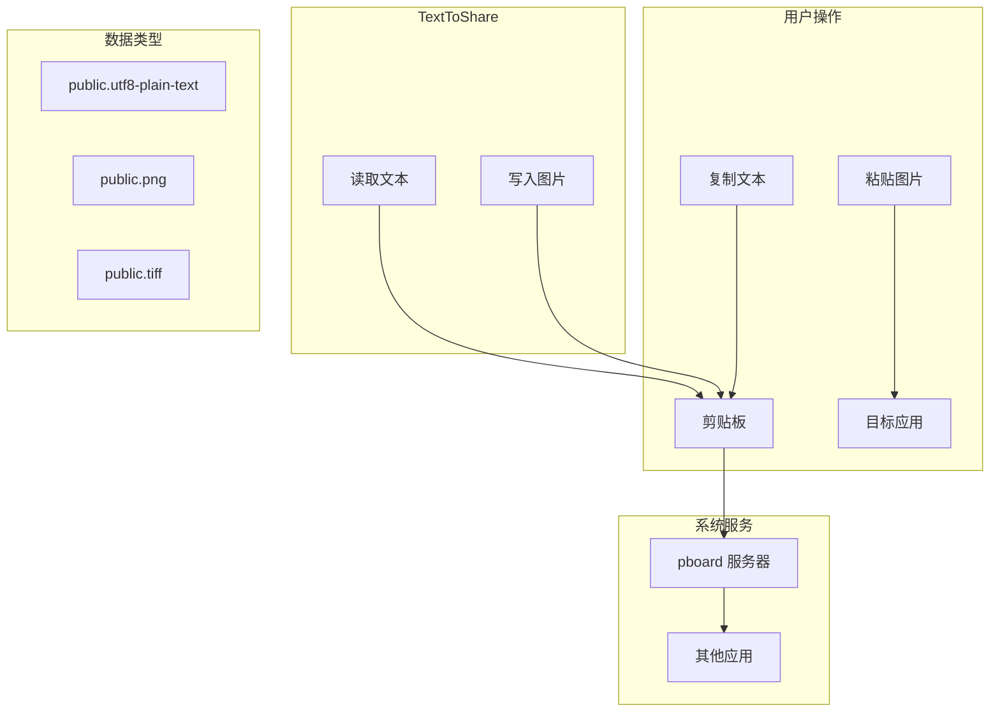

# 剪贴板集成详解

## 📋 NSPasteboard 概述

`NSPasteboard` 是 macOS 系统提供的剪贴板服务接口，允许应用之间共享数据。TextToShare 通过剪贴板实现文本输入和图片输出，是应用与用户数据流的核心桥梁。

## 🔌 剪贴板架构

### 系统架构图



## 📖 NSPasteboard 基础

### 获取剪贴板实例

```swift
// 获取通用剪贴板
let clipboard = NSPasteboard.general

// 获取特定剪贴板（如查找剪贴板）
let findPboard = NSPasteboard.find

// 获取拖放剪贴板
let dragPboard = NSPasteboard(name: .drag)
```

### 常用剪贴板类型

```swift
// 文本类型
extension NSPasteboard.PasteboardType {
    static let text = NSPasteboard.PasteboardType("public.utf8-plain-text")
    static let rtf = NSPasteboard.PasteboardType("public.rtf")
    static let html = NSPasteboard.PasteboardType("public.html")
}

// 图片类型
extension NSPasteboard.PasteboardType {
    static let png = NSPasteboard.PasteboardType("public.png")
    static let tiff = NSPasteboard.PasteboardType("public.tiff")
    static let jpeg = NSPasteboard.PasteboardType("public.jpeg")
}

// 文件类型
extension NSPasteboard.PasteboardType {
    static let fileURL = NSPasteboard.PasteboardType("public.file-url")
    static let fileName = NSPasteboard.PasteboardType("public.file-name")
}
```

## 📥 文本读取实现

### 基础文本读取

```swift
func readTextFromClipboard() -> String? {
    // 1. 获取剪贴板
    let clipboard = NSPasteboard.general

    // 2. 读取字符串
    let text = clipboard.string(forType: .string)

    // 3. 验证和处理
    guard let unwrappedText = text,
          !unwrappedText.isEmpty,
          !unwrappedText.trimmingCharacters(in: .whitespacesAndNewlines).isEmpty else {
        return nil
    }

    return unwrappedText
}
```

### 高级文本处理

```swift
func processTextFromClipboard() -> ProcessedText? {
    let clipboard = NSPasteboard.general

    // 1. 获取所有可用的文本类型
    let availableTypes = clipboard.types ?? []
    let textTypes: [NSPasteboard.PasteboardType] = [
        .string,           // 纯文本
        .rtf,              // 富文本
        .html,             // HTML
        .plainText         // UTF-8 文本
    ]

    // 2. 按优先级尝试读取
    for type in textTypes {
        if availableTypes.contains(type) {
            if let data = clipboard.data(forType: type) {
                switch type {
                case .string, .plainText:
                    return ProcessedText(
                        content: String(data: data, encoding: .utf8) ?? "",
                        format: .plain,
                        attributes: [:]
                    )
                case .rtf:
                    return processRTF(data: data)
                case .html:
                    return processHTML(data: data)
                default:
                    continue
                }
            }
        }
    }

    return nil
}
```

### 文本预处理

```swift
struct ProcessedText {
    let content: String
    let format: TextFormat
    let attributes: [NSAttributedString.Key: Any]

    enum TextFormat {
        case plain
        case rich
        case html
    }
}

func preprocessText(_ text: ProcessedText) -> String {
    var processed = text.content

    // 1. 标准化换行
    processed = processed.replacingOccurrences(of: "\r\n", with: "\n")
    processed = processed.replacingOccurrences(of: "\r", with: "\n")

    // 2. 清理多余空白
    processed = processed.trimmingCharacters(in: .whitespacesAndNewlines)

    // 3. 处理特殊字符
    processed = processed.replacingOccurrences(of: "\t", with: "    ")

    // 4. 限制长度
    if processed.count > 10000 {
        processed = String(processed.prefix(10000)) + "\n...（内容已截断）"
    }

    return processed
}
```

## 📤 图片写入实现

### 基础图片写入

```swift
func writeImageToClipboard(_ image: NSImage) -> Bool {
    // 1. 获取剪贴板
    let clipboard = NSPasteboard.general

    // 2. 清空内容
    clipboard.clearContents()

    // 3. 写入图片
    let success = clipboard.writeObjects([image])

    return success
}
```

### 多格式图片写入

```swift
func writeImageFormats(_ image: NSImage) -> Bool {
    let clipboard = NSPasteboard.general
    clipboard.clearContents()

    // 1. 准备多种格式
    var dataDict: [NSPasteboard.PasteboardType: Data] = [:]

    // TIFF 格式（原生）
    if let tiffData = image.tiffRepresentation {
        dataDict[.tiff] = tiffData
    }

    // PNG 格式
    if let tiffData = image.tiffRepresentation,
       let bitmapImage = NSBitmapImageRep(data: tiffData),
       let pngData = bitmapImage.representation(using: .png, properties: [:]) {
        dataDict[.png] = pngData
    }

    // JPEG 格式
    if let tiffData = image.tiffRepresentation,
       let bitmapImage = NSBitmapImageRep(data: tiffData),
       let jpegData = bitmapImage.representation(using: .jpeg, properties: [:]) {
        dataDict[.jpeg] = jpegData
    }

    // 2. 写入所有格式
    var success = false
    for (type, data) in dataDict {
        success = clipboard.setData(data, forType: type) || success
    }

    return success
}
```

### 图片优化写入

```swift
func writeOptimizedImage(_ image: NSImage) -> Bool {
    // 1. 根据内容选择最佳格式
    let isTextHeavy = isTextDominantImage(image)
    let targetFormat: NSBitmapImageRep.FileType = isTextHeavy ? .png : .jpeg

    // 2. 优化图片尺寸
    let optimizedImage = optimizeImageForSharing(image)

    // 3. 生成数据
    guard let tiffData = optimizedImage.tiffRepresentation,
          let bitmapImage = NSBitmapImageRep(data: tiffData),
          let imageData = bitmapImage.representation(
            using: targetFormat,
            properties: getCompressionProperties(for: targetFormat)
          ) else {
        return false
    }

    // 4. 写入剪贴板
    let clipboard = NSPasteboard.general
    clipboard.clearContents()

    // 写入优化后的图片和原始图片
    var success = clipboard.setData(imageData, forType: .png)
    success = clipboard.writeObjects([optimizedImage]) || success

    return success
}

func getCompressionProperties(for format: NSBitmapImageRep.FileType) -> [NSBitmapImageRep.PropertyKey: Any] {
    switch format {
    case .png:
        return [.compressionFactor: 0.9]
    case .jpeg:
        return [.compressionFactor: 0.85]
    default:
        return [:]
    }
}
```

## 🔍 剪贴板监控

### 剪贴板变化监听

```swift
class ClipboardMonitor {
    private var timer: Timer?
    private var lastChangeCount: Int = 0
    private let callback: () -> Void

    init(callback: @escaping () -> Void) {
        self.callback = callback
    }

    func startMonitoring() {
        timer = Timer.scheduledTimer(withTimeInterval: 0.5, repeats: true) { [weak self] _ in
            self?.checkClipboard()
        }
    }

    func stopMonitoring() {
        timer?.invalidate()
        timer = nil
    }

    private func checkClipboard() {
        let clipboard = NSPasteboard.general
        let currentChangeCount = clipboard.changeCount

        if currentChangeCount != lastChangeCount {
            lastChangeCount = currentChangeCount
            DispatchQueue.main.async {
                self.callback()
            }
        }
    }
}
```

### 剪贴板历史管理

```swift
class ClipboardHistory {
    private var history: [ClipboardItem] = []
    private let maxHistoryCount = 10

    struct ClipboardItem {
        let content: Any
        let type: NSPasteboard.PasteboardType
        let timestamp: Date
    }

    func addItem(_ item: Any, type: NSPasteboard.PasteboardType) {
        let newItem = ClipboardItem(
            content: item,
            type: type,
            timestamp: Date()
        )

        // 避免重复
        if !history.contains(where: { $0.timestamp.distance(to: newItem.timestamp) < 1 }) {
            history.insert(newItem, at: 0)
            if history.count > maxHistoryCount {
                history.removeLast()
            }
        }
    }

    func getRecentItems() -> [ClipboardItem] {
        return Array(history.prefix(5))
    }
}
```

## 🔐 权限和安全

### 剪贴板权限检查

```swift
func checkClipboardPermission() -> Bool {
    // macOS 10.14+ 需要检查剪贴板访问权限
    if #available(macOS 10.14, *) {
        let source = CGEventSource(stateID: .combinedSessionState)
        return source?.state == .enabled
    }
    return true
}

func requestClipboardPermissionIfNeeded() {
    if #available(macOS 10.14, *) {
        // 第一次访问时会自动触发权限请求
        let clipboard = NSPasteboard.general
        _ = clipboard.string(forType: .string)
    }
}
```

### 数据清理和安全

```swift
func sanitizeClipboardData() {
    let clipboard = NSPasteboard.general
    let types = clipboard.types ?? []

    // 1. 只保留安全的数据类型
    let safeTypes: [NSPasteboard.PasteboardType] = [
        .string, .plainText, .rtf, .html,
        .png, .tiff, .jpeg,
        .fileURL
    ]

    let unsafeTypes = Set(types).subtracting(Set(safeTypes))

    if !unsafeTypes.isEmpty {
        // 清理不安全的类型
        clipboard.clearContents()

        // 重新写入安全的数据
        for type in safeTypes {
            if let data = clipboard.data(forType: type) {
                clipboard.setData(data, forType: type)
            }
        }
    }
}
```

### 敏感信息检测

```swift
func containsSensitiveInfo(_ text: String) -> Bool {
    // 1. 密码模式检测
    let passwordPatterns = [
        #"password\s*[:=]\s*\S+"#i,
        #"pwd\s*[:=]\s*\S+"#i,
        #"secret\s*[:=]\s*\S+"#i
    ]

    // 2. API 密钥检测
    let apiKeyPatterns = [
        #"api[_-]?key\s*[:=]\s*\S+"#i,
        #"token\s*[:=]\s*[a-zA-Z0-9]{20,}"#i
    ]

    // 3. 私钥检测
    let privateKeyPattern = #"-----BEGIN\s*(RSA\s+)?PRIVATE\s+KEY-----"#

    let allPatterns = passwordPatterns + apiKeyPatterns + [privateKeyPattern]

    for pattern in allPatterns {
        let regex = try? NSRegularExpression(pattern: pattern, options: .caseInsensitive)
        let range = NSRange(location: 0, length: text.utf16.count)
        if regex?.firstMatch(in: text, options: [], range: range) != nil {
            return true
        }
    }

    return false
}
```

## 🔄 高级功能

### 拖放支持

```swift
func setupDragAndDrop() {
    let imageView = NSImageView()
    imageView.unregisterDraggedTypes()
    imageView.registerForDraggedTypes([.fileURL, .png, .tiff])

    imageView.draggingDestinationHandler = { (sender, info) in
        // 处理拖入的图片
        if let fileURL = info.draggingPasteboard.readObjects(forClasses: [NSURL.self],
                                                            options: nil)?.first as? URL {
            self.loadImageFromURL(fileURL)
        }
    }
}
```

### 剪贴板格式转换

```swift
func convertTextToImage(_ text: String) -> NSImage? {
    // 1. 创建文本属性
    let attributes: [NSAttributedString.Key: Any] = [
        .font: NSFont.systemFont(ofSize: 24),
        .foregroundColor: NSColor.black
    ]

    // 2. 计算文本尺寸
    let attributedString = NSAttributedString(string: text, attributes: attributes)
    let size = attributedString.boundingRect(
        with: NSSize(width: 600, height: .greatestFiniteMagnitude),
        options: .usesLineFragmentOrigin
    ).size

    // 3. 创建图片
    let image = NSImage(size: size)
    image.lockFocus()
    attributedString.draw(at: .zero)
    image.unlockFocus()

    return image
}
```

### 剪贴板链管理

```swift
func manageClipboardChain() {
    // 保存当前剪贴板内容
    let currentContent = NSPasteboard.general
    let savedTypes = currentContent.types ?? []
    var savedData: [NSPasteboard.PasteboardType: Data] = [:]

    for type in savedTypes {
        if let data = currentContent.data(forType: type) {
            savedData[type] = data
        }
    }

    // 执行操作...

    // 恢复剪贴板内容
    currentContent.clearContents()
    for (type, data) in savedData {
        currentContent.setData(data, forType: type)
    }
}
```

## 📊 性能优化

### 异步剪贴板操作

```swift
actor ClipboardManager {
    private let clipboard = NSPasteboard.general

    func readTextAsync() async -> String? {
        return await withCheckedContinuation { continuation in
            DispatchQueue.global(qos: .userInitiated).async {
                let text = self.clipboard.string(forType: .string)
                continuation.resume(returning: text)
            }
        }
    }

    func writeImageAsync(_ image: NSImage) async -> Bool {
        return await withCheckedContinuation { continuation in
            DispatchQueue.global(qos: .userInitiated).async {
                self.clipboard.clearContents()
                let success = self.clipboard.writeObjects([image])
                continuation.resume(returning: success)
            }
        }
    }
}
```

### 缓存机制

```swift
class ClipboardCache {
    private var cache: [String: NSImage] = [:]
    private let maxCacheSize = 50

    func cachedImage(for text: String) -> NSImage? {
        let key = text.sha256()
        return cache[key]
    }

    func cacheImage(_ image: NSImage, for text: String) {
        let key = text.sha256()
        cache[key] = image

        // 清理缓存
        if cache.count > maxCacheSize {
            let oldestKey = cache.keys.first
            if let key = oldestKey {
                cache.removeValue(forKey: key)
            }
        }
    }
}
```

## 🐛 常见问题解决

### 1. 剪贴板访问失败

**问题**: 无法读取剪贴板内容

**解决方案**:
```swift
// 检查应用权限
func checkAndRequestPermission() {
    if #available(macOS 10.14, *) {
        let status = NSWorkspace.shared.url(forApplicationToOpen: URL(fileURLWithPath: "/"))
        // 引导用户开启权限
    }
}
```

### 2. 剪贴板内容被占用

**问题**: 剪贴板被其他应用锁定

**解决方案**:
```swift
// 重试机制
func writeToClipboardWithRetry(_ image: NSImage, maxRetries: Int = 3) -> Bool {
    for _ in 0..<maxRetries {
        if writeImageToClipboard(image) {
            return true
        }
        Thread.sleep(forTimeInterval: 0.1)
    }
    return false
}
```

### 3. 内存泄漏

**问题**: 大量图片数据导致内存增长

**解决方案**:
```swift
// 使用自动释放池
autoreleasepool {
    let imageData = processLargeImage(image)
    writeToClipboard(imageData)
}
```

## 📚 相关文档

- [应用代理](04-app-delegate.md) - 了解剪贴板在应用生命周期中的使用
- [图片生成](05-image-generator.md) - 掌握图片处理和输出

---

**下一步：建议阅读 [开发指南](10-development-guide.md) 来了解完整的开发环境和最佳实践。**